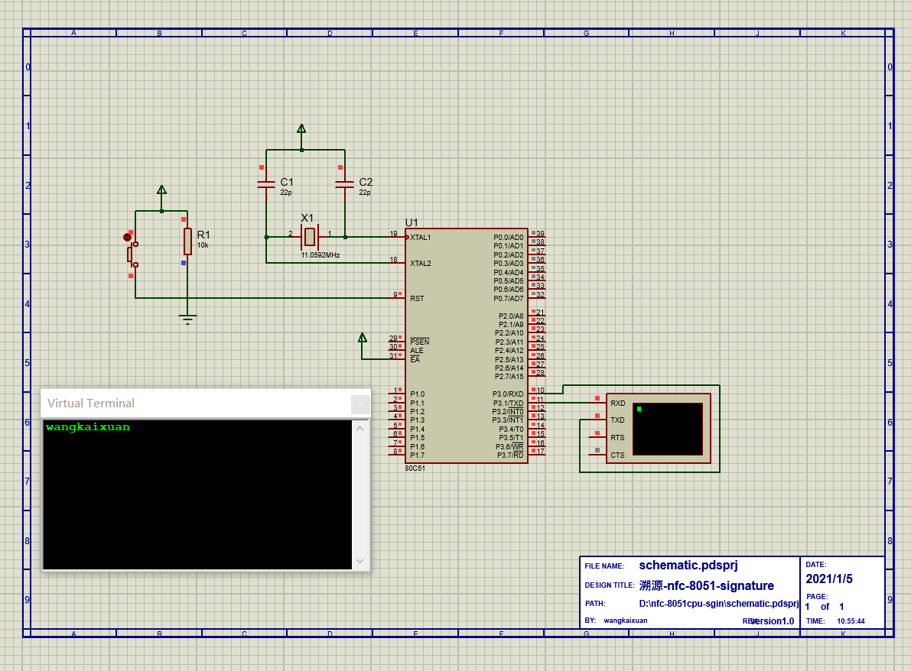

# 简介
1. 本代码目标运行平台8051系列CPU
2. 使用`keilc51`进行编译和仿真
3. 本项目使用secp256r1进行了验证，验证方法是：
   1. 在仿真平台中对字符串`hello`的sha256哈希值进行签名
   2. 在keil的命令窗口保存签名值和公钥，使用公钥和签名值到外部系统进行验证
# keilc51保存内存中的值（变量）
1. save signatureR.txt X:0x000004,X:0x000023
2. save signatureS.txt X:0x000024,X:0x000043
3. save publicX.txt X:0x000044,X:0x000063
4. save publicY.txt X:0x000064,X:0x000083

# nfc-8051cpu-sgin
1. 现象：keil c51 compiler：
   1. 不支持long数据类型
   2. 变量声明必须在函数块头部
   3. ...
2. 原因：编译器是c89`C51 COMPILER V9.60.0.0 - SN: Eval Version`，不支持一些现代C语言的一些特性
3. 参考：[c51](https://www.keil.com/c51/cx51.asp)
4. 解决办法：换一个更现代的编译器，eg：sdcc

# 使用sdcc
1. [8051-Programming-Using-Small-Device-C-Compiler-SDC](https://www.instructables.com/8051-Programming-Using-Small-Device-C-Compiler-SDC/)
2. [sdcc](http://sdcc.sourceforge.net/)
3. 使用方法：
   1. vscode编辑代码
   2. 添加代码到proteus中
   3. 在proteus中编译和执行

# 参考
1. 移植的原库[nano-ecc](https://github.com/iSECPartners/nano-ecc)
2. JavaScript`secp256r1`签名库[ecdsa-secp256r1](https://github.com/forevertz/ecdsa-secp256r1)
